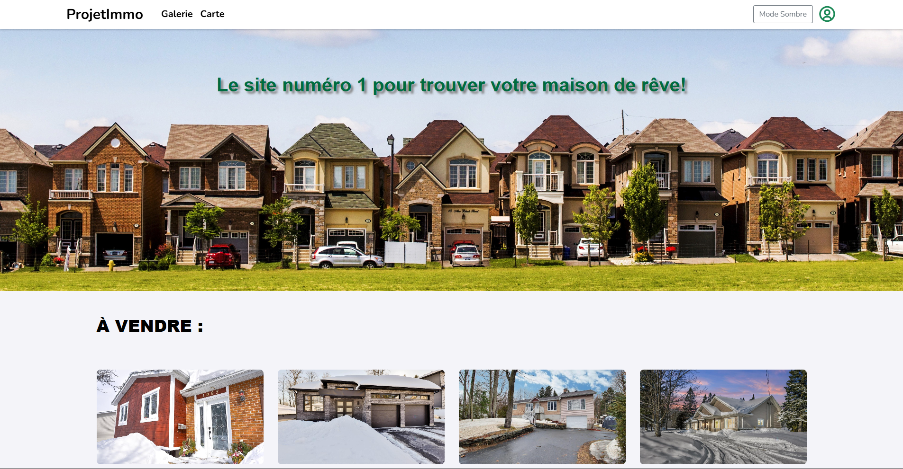

# 🏠 REAL-ESTATE-AWS

> A full-stack real estate web application deployed on AWS EC2 with Infrastructure as Code using Terraform.



---

## Features

| Feature | Description |
|---------|-------------|
| **Property Browsing** | Browse and search real estate listings with advanced filters |
| **Interactive Maps** | View properties on an interactive map using Mapbox GL |
| **Favorites System** | Save and manage your favorite properties |
| **User Authentication** | Secure user registration and login with BCrypt encryption |
| **Responsive Design** | Works seamlessly on desktop, tablet, and mobile devices |
| **SSL Security** | Automatic HTTPS with Let's Encrypt certificates |

---

## Technology Stack

- **Frontend**: React 19, Vite, Bootstrap, Mapbox GL
- **Backend**: Spring Boot 3, Java 17, Spring Security
- **Database**: MariaDB with JPA/Hibernate
- **Infrastructure**: AWS EC2, Docker, Traefik, DuckDNS
- **DevOps**: Terraform, Docker Compose

---

## Prerequisites

Before deploying, ensure you have:

- **AWS CLI** - [Prerequisites](https://docs.aws.amazon.com/cli/latest/userguide/getting-started-prereqs.html) | [Installation](https://docs.aws.amazon.com/cli/latest/userguide/getting-started-install.html)
- **Terraform** - [Installation Guide](https://developer.hashicorp.com/terraform/tutorials/aws-get-started/install-cli)
- **Git** - For cloning the repository
- **AWS Account** - With EC2 permissions
- **DuckDNS** - Domain and account token

---

## Quick Start

### Step 0: AWS CLI Configuration

> **Important**: Configure your AWS credentials before proceeding

- [Set up your AWS CLI credentials](https://docs.aws.amazon.com/cli/latest/userguide/cli-chap-configure.html)
- **Windows**: `C:/Users/yourUser/.aws/credentials`
- **Linux/Mac**: `~/.aws/credentials`

### Step 1: Clone the Repository

```bash
git clone https://github.com/ManasseTegGbegnohou/REAL-ESTATE-AWS.git
cd REAL-ESTATE-AWS
```

### Step 2: Deploy Infrastructure

```bash
cd REAL-ESTATE-AWS-INFRASTRUCTURE-AS-CODE/terraform-config
terraform init
terraform plan
terraform apply
```

>  **Note**: This will create an EC2 instance and may take 2-3 minutes

### 3. Configure Environment Variables

After EC2 instance is created, SSH into it:

```bash
# Windows - Set key permissions 
icacls "C:\Users\yourUser\Desktop\REAL-ESTATE-AWS\REAL-ESTATE-AWS-INFRASTRUCTURE-AS-CODE\terraform-config\PROJET-IMMO-keypair.pem" /inheritance:r
icacls "C:\Users\yourUser\Desktop\REAL-ESTATE-AWS\REAL-ESTATE-AWS-INFRASTRUCTURE-AS-CODE\terraform-config\PROJET-IMMO-keypair.pem" /remove "Administrators" "SYSTEM" "Users" "Authenticated Users" "Everyone"
icacls "C:\Users\yourUser\Desktop\REAL-ESTATE-AWS\REAL-ESTATE-AWS-INFRASTRUCTURE-AS-CODE\terraform-config\PROJET-IMMO-keypair.pem" /grant:r "yourUser:R"

# SSH into EC2
ssh -i "PROJET-IMMO-keypair.pem" ubuntu@yourEC2ip
```

### 4. Deploy Application

```bash
# Navigate to services directory
cd REAL-ESTATE-AWS/REAL-ESTATE-AWS-SERVICES

# Configure environment variables
cp .env.template .env
nano .env
```

**Required Environment Variables:**
```bash
MY_DOMAIN=yourdomain.duckdns.org
DUCKDNS_TOKEN=your-duckdns-token
ACME_EMAIL=your-email@example.com
```

### 5. Deploy and Start Services

```bash
# Make deploy script executable
chmod +x deploy.sh

# Deploy the application
./deploy.sh
```

**Wait approximately 5 minutes for full deployment.**

## Access Your Application

Once deployed, access your application at:

- **Frontend**: `https://manacGrace-real-estate.yourdomain.duckdns.org`
- **Backend API**: `https://manacGrace-real-estate-backend.yourdomain.duckdns.org/api`
- **Traefik Dashboard**: `https://yourdomain.duckdns.org`

## Documentation

Detailed documentation is available in the `wiki/` directory:

- [Infrastructure Setup](https://github.com/manacGrace/REAL-ESTATE-AWS/wiki/0.-Infrastructure)
- [Frontend Documentation](https://github.com/manacGrace/REAL-ESTATE-AWS/wiki/1.-Frontend)
- [Backend Documentation](https://github.com/manacGrace/REAL-ESTATE-AWS/wiki/2.-Backend)
- [Database Documentation](https://github.com/manacGrace/REAL-ESTATE-AWS/wiki/3.-Database)
- [Container Documentation](https://github.com/manacGrace/REAL-ESTATE-AWS/wiki/4.-Containers)
- [Technology Stack](https://github.com/manacGrace/REAL-ESTATE-AWS/wiki/5.-Technology-Stack)

## Development

### Local Development Setup

1. **Frontend Development**:
   ```bash
   cd REAL-ESTATE-AWS-SERVICES/ProjetImmo_FE
   npm install
   npm run dev
   ```

2. **Database Setup**:
   - Install MariaDB locally
   - Create database: `CREATE DATABASE realdb;`
   - Execute the SQL script: `REAL-ESTATE-AWS-SERVICES/seed/seed.sql`

3. **Backend Development**:
   - Update database credentials in `REAL-ESTATE-AWS-SERVICES/ProjetImmo_BE/src/main/resources/application.properties`:
   ```properties
   spring.datasource.username=root
   spring.datasource.password=your-local-password
   spring.datasource.url=jdbc:mariadb://localhost:3306/realdb
   ```
   
   ```bash
   cd REAL-ESTATE-AWS-SERVICES/ProjetImmo_BE
   mvn spring-boot:run
   ```

### Docker Development

```bash
cd REAL-ESTATE-AWS-SERVICES
docker-compose up -d
```
